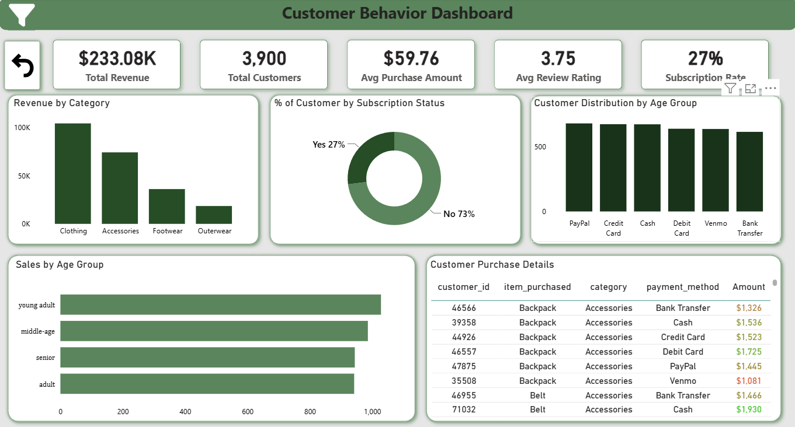

# 🛍️ Customer Shopping Behavior Analysis

An end-to-end data analytics project that explores **3,900 retail transactions** to uncover customer purchasing patterns, using **Python** for data cleaning, **MySQL** for structured querying, and **Power BI** for interactive visualization.

---

## 📌 Project Overview

This project analyzes customer shopping behavior data to answer key business questions around revenue trends, discounts, subscriptions, customer loyalty, and product performance — helping translate raw transactional data into actionable business recommendations.

## Dashboard Screenshot


**Workflow:**
```
CSV Data → Python (Cleaning & Feature Engineering) → MySQL (SQL Analysis) → Power BI (Dashboard) → Insights & Recommendations
```

---

## 🗂️ Dataset

- **Rows:** 3,900 transactions
- **Columns:** 18 features
- **Missing values:** 37 (Review Rating only)

**Key features:**
| Category | Fields |
|---|---|
| Demographics | Age, Gender, Location, Subscription Status |
| Purchase Info | Item Purchased, Category, Purchase Amount, Season |
| Behavior | Discount Applied, Frequency of Purchases, Review Rating, Shipping Type |

---

## 🧹 Data Preparation (Python)

Performed in `customer_shopping_behavior_analysis.ipynb` using **pandas** and **numpy**:

1. **Load & Explore** – Imported data via pandas; used `df.info()` and `df.describe()` for initial checks.
2. **Clean Missing Data** – Imputed missing `Review Rating` values using the median per category.
3. **Feature Engineering** – Created new columns: `age_group` and `purchase_frequency_days`.
4. **Load to MySQL** – Pushed the cleaned DataFrame into a MySQL database (via `SQLAlchemy`) for SQL-based analysis.

---

## 🗄️ SQL Analysis

`customer_shopping_behavior_dashboard.sql` contains 10 business-question queries, including:

1. Total revenue by gender
2. Customers who used a discount but spent above average
3. Top 5 products by average review rating
4. Standard vs. Express shipping — average purchase comparison
5. Subscribers vs. non-subscribers — spend & revenue comparison
6. Top 5 most-discounted products
7. Customer segmentation (New / Returning / Loyal) by purchase history
8. Top 3 products per category
9. Repeat buyers (>5 purchases) vs. subscription status
10. Revenue contribution by age group

---

## 📊 Power BI Dashboard

`Customer_Behavior_Dashboard.pbix` — an interactive dashboard with filters for **Subscription Status, Gender, Category, and Shipping Type**, featuring:

- KPI cards: 3.9K customers, $59.76 avg. purchase, 3.75 avg. rating, 27% subscribers
- Revenue breakdown by gender, age group, and category
- Product ratings & discount rate visuals
- Subscriber vs. non-subscriber revenue comparison


---

## 🔑 Key Insights

- **Gender gap:** Male customers generated **2.1× more revenue** than female customers ($157,890 vs. $75,191).
- **Subscription paradox:** Only **27%** of customers are subscribers, yet non-subscribers drive **$170K** in revenue — subscribers and non-subscribers spend almost the same on average (~$59.5–59.9).
- **Loyalty:** 3,116 customers fall into the "Loyal" segment vs. only 701 "Returning" and 83 "New."
- **Conversion opportunity:** Of 958 repeat buyers (>5 purchases), only 27% are subscribed — a clear upsell target.
- **Category performance:** Clothing and Accessories drive the most category revenue, far ahead of Footwear and Outerwear.
- **Top-rated products:** Gloves, Sandals, and Boots have the highest average review ratings (~3.8+).

---

## 💡 Business Recommendations

- **Boost Subscriptions** – Promote exclusive subscriber-only benefits.
- **Loyalty Programs** – Reward repeat buyers to grow the Loyal segment further.
- **Review Discount Policy** – Balance discount-driven sales boosts with margin control.
- **Product Positioning** – Highlight top-rated, best-selling products in marketing.
- **Targeted Marketing** – Focus campaigns on high-revenue age groups and express-shipping users.

---

## 🛠️ Tech Stack

| Tool | Purpose |
|---|---|
| Python (pandas, numpy) | Data cleaning & feature engineering |
| SQLAlchemy + MySQL | Database storage & SQL querying |
| Power BI | Interactive dashboard & visualization |
| Jupyter Notebook | Analysis workflow |

---

## 📁 Repository Structure

```
├── customer_shopping_behavior.csv                 # Raw dataset
├── customer_shopping_behavior_analysis.ipynb      # Data cleaning & feature engineering (Python)
├── customer_shopping_behavior_dashboard.sql       # SQL business-question queries
├── Customer_Behavior_Dashboard.pbix               # Power BI dashboard
├── Customer-Shopping-Behavior-Analysis.pdf        # Project presentation/summary
└── README.md
```

---

## 🚀 How to Reproduce

1. Clone the repository and open `customer_shopping_behavior_analysis.ipynb` in Jupyter.
2. Update the MySQL connection details (username, password, host, database) with your own credentials.
3. Run the notebook to clean the data and load it into your MySQL database.
4. Execute the queries in `customer_shopping_behavior_dashboard.sql` against the loaded table.
5. Open `Customer_Behavior_Dashboard.pbix` in Power BI Desktop and refresh the data source to explore the dashboard.

---

## 📄 License

This project is open-sourced for learning and portfolio purposes. Feel free to fork and build upon it.
